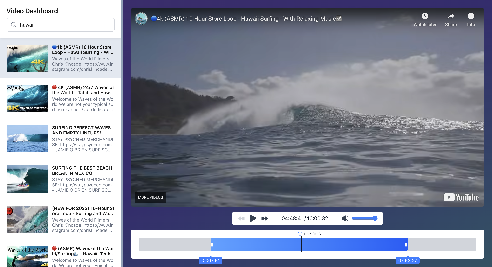

# YouTube Dashboard 📺

This project is a YouTube dashboard built with Next.js, TypeScript and TailwindCSS.

## Live Demo

Check the live demo here: [Vercel Demo](https://youtube-dashboard-henna.vercel.app/)

## Quick Start

- Clone the repo
- Run `npm install`
- Run `npm run dev`
- Visit [http://localhost:3000](http://localhost:3000) in your browser

## Key Features ✨

- **Sidebar** with a video list, search, and infinite scrolling
- **Video player** with play/pause, previous/next video buttons, and sound control
- **Video trimming** with a progress bar, saving trimmed segments in local storage for later use

**System Requirement:** Node 18.18+

## Screenshots

Here's a preview of what you'll see:

## Areas for Improvement

#1 **Video Routing**:
Adding unique URLs for each video (`/videos/{id}`) so users can refresh the page without losing their place, share
videos, and bookmark them.

#2 **Dynamic Video Resizing**:
Making the video player adjust to 100% of the width or height (depending on screen size) while keeping 16:9 aspect
ratio.
